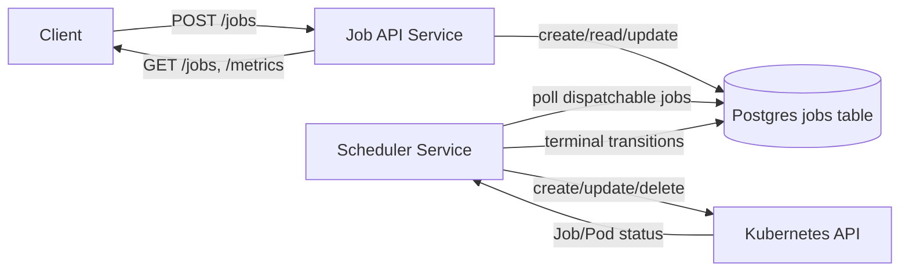

# System Overview

## Purpose
This platform provides a Kubernetes-native distributed job system where API submission persists authoritative state in Postgres, a scheduler reconciles queued jobs into Kubernetes `Job` resources, and completion state is written back to Postgres for reliable API reads, retries, and operational visibility.

## Components Diagram

## Control Flow
1. Client submits job to API (`POST /jobs`) with `Idempotency-Key` and `X-Tenant-Id`.
2. API validates request and persists `QUEUED` row in Postgres.
3. Scheduler polls dispatchable rows (`QUEUED` plus retry gate), applies tenant concurrency limit (`TENANT_MAX_RUNNING`), and creates a Kubernetes `batch/v1 Job`.
4. Scheduler marks job `RUNNING` and tracks execution outcomes from Kubernetes Job status.
5. Scheduler writes terminal state (`SUCCEEDED`/`FAILED`/retry requeue metadata) back to Postgres.
6. API `GET /jobs/{id}` reflects persisted lifecycle state from Postgres.

## Data Flow
- Stored in Postgres (authoritative):
  - Job spec fields (`image`, `command`, `args`, `env`, queue/priority controls)
  - State machine fields (`status`, `attempts`, `max_retries`, `next_retry_at`)
  - Runtime timestamps (`created_at`, `started_at`, `finished_at`)
  - Tenant identity (`tenant_id`) and idempotency metadata.
- Inferred from Kubernetes at reconcile time:
  - Whether the backing `Job` exists.
  - Succeeded/failed counts and terminal reasons.
  - Pod execution logs/events used for evidence and debugging.

## Current Tenant and Quota Behavior
- Tenant identity is required for submit via `X-Tenant-Id` header (validated in API path).
- Scheduler enforces per-tenant running concurrency via `TENANT_MAX_RUNNING` (configured in scheduler deployment).
- These controls are part of the current runtime contract and are documented in the repository quickstart and reflection/evidence flow.
